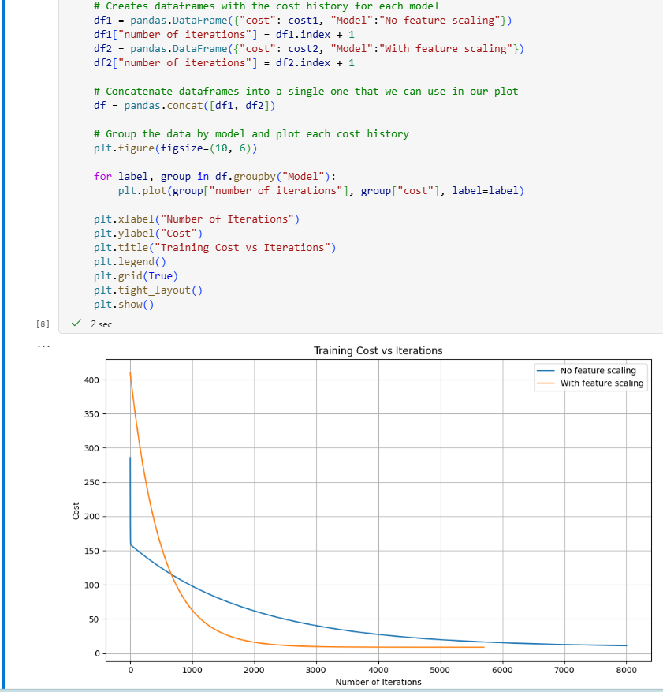

# fescarefine ⛷️🗻🦮
fescarefine: Refine &amp; Test ML models # Features Scaling # Normalization # Datasets

## Objective
- Define feature scaling/normalization.
- Create and work with test datasets.
- Articulate how testing models can both improve and harm training.

## Scenario: Avalanche Rescue Dogs
- To make the concepts relatable, the module uses a fictional scenario:
- A charity is training dogs to rescue hikers trapped in avalanches.
- There's debate over which traits matter most-size, age, etc.
- Historical rescue data is available to guide training decisions.
- Since training is costly, choosing the right dogs is critical.
- This sets up a classic supervised learning problem: using labeled data (dog traits + rescue outcomes) to build a predictive model.

##  Refine & Test ML models 

